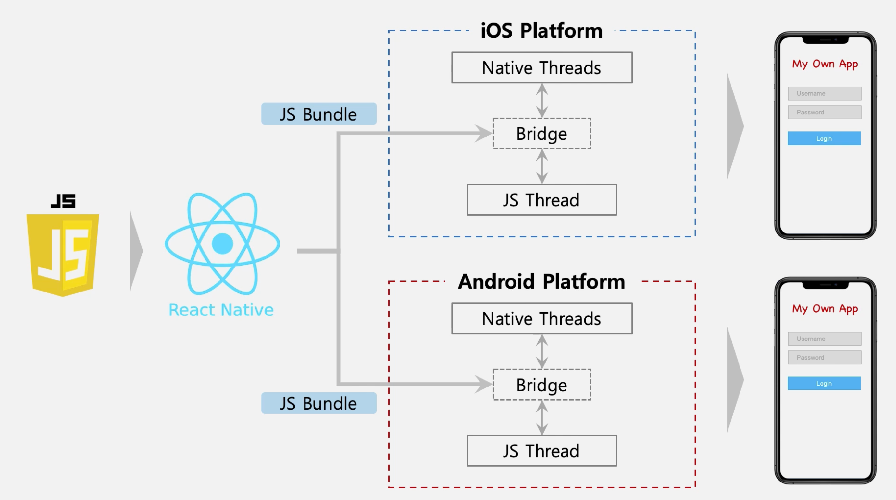

## 기본 원리

### React Native

**1. Bundling**

JS 파일을 React N 이 번들링하여, 각 플랫폼에 제공(?)한다.

**2. Bridge**

(플랫폼 단에서) JS Thread 와 Native Threads 가 매끄럽게 이어질 수 있도록(?) Bridge 를 제공한다.

 

### Bulding 종류

|종류|장점|단점|
|-|-|-|
|**Expo CLI**|1. 개발 환경 구축이 쉽다.    2. 실제로 개발이 쉽고 편하다.|1. OS Layer 와 직접 상호작용 불가능하다. (Java, Kotlin, Object-C, Swift 로 추가 작성이 불가능하다.)    2. Expo에서 제공해주는 모듈만 사용 가능하다.    3. Expo Client 에서는 잘 동작하지만 실제 시뮬레이터/단말기에서는 잘 동작하지 않을 수 있다.    4. 개발 관점에서 자유도가 낮다.|
|**React Native CLI**|1. (Expo로는 접근하지 못하는) Native 기능에 접근 가능하다. (Native 모듈 사용 자유도가 높다.)    2. 원하는 언어로 추가 작성 가능하다. (Custom Native 모듈 사용 가능하다.)    3. 필요한 기능이 있는 경우, 모듈을 직접 제작 가능하다.    4. OS Layer 와 직접적인 상호작용 가능하다.|1. 초기 개발환경 구축 / 실제 앱 개발에 다소 시간이 걸릴 수 있다. (Expo와 비교했을 때)|

 

### Installation

- node (nvm) 
  - ex : node: 10.15.1, npm : 6.13.7
- 

